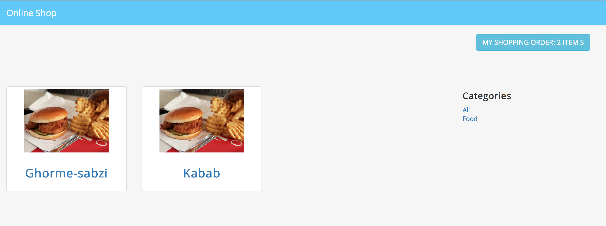
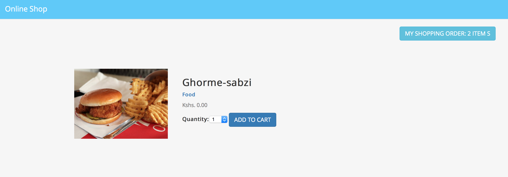
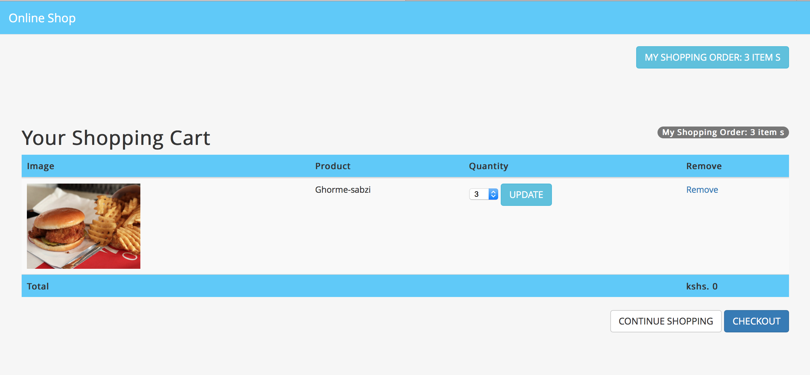
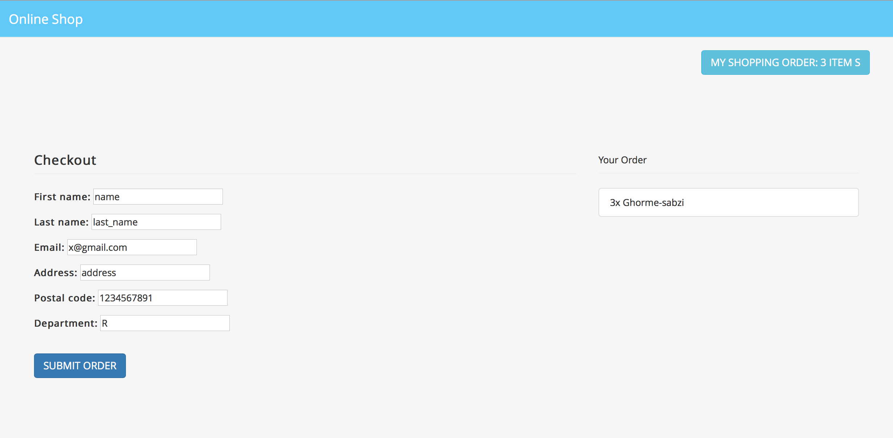
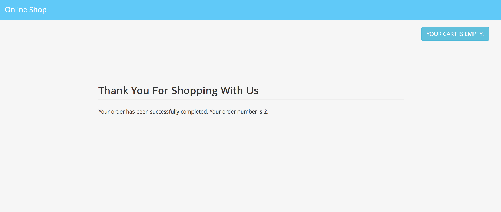

# Ecommerce Website 

this is a very simple django e-commerce website without login or signup.  
here is what it has:
<ul>
	<li>Home: lists all the items  </li>
	<li>Item detail: the image, quantity, name and ...  </li>
	<li>Cart: add, remove or update the items in your cart  </li>
	<li>Order: buy the things in your cart  </li>
	<li>Your order was submitted  </li>
</ul>
